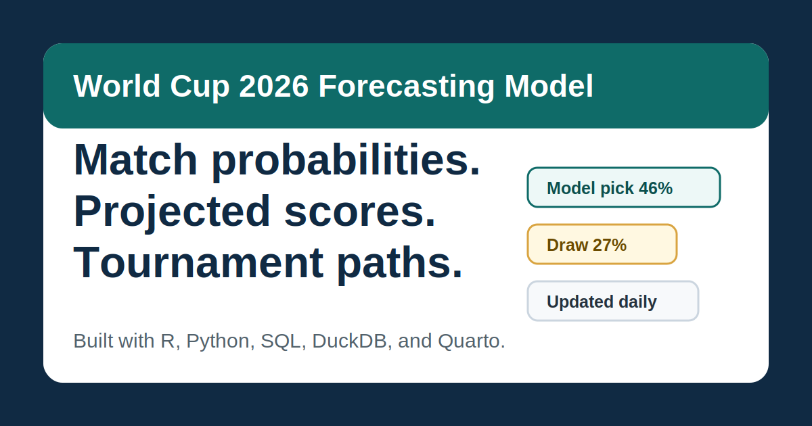

# World Cup 2026 Forecasting Model

A reproducible forecasting system that produces match probabilities, projected scores, tournament paths, and post-match model evaluation.

[View live forecasts](https://lindadata.github.io/world-cup-2026-betting-model/)



## Current Status

The public site is a static Quarto website built from local model outputs. The prediction board refreshes from the existing data pipeline and publishes summarized results to GitHub Pages. Raw data, API keys, credentials, and private files are intentionally excluded from the public site.

## Key Outputs

- Today's match forecasts with win, draw, and loss probabilities.
- Next-match forecast with projected score and expected goals.
- Upcoming match cards with accessible one-tap details.
- Interactive tournament bracket seeded from current projections.
- Post-match model accuracy table.
- Technical model reports for methodology review.

## Technology Stack

- **R / RStudio:** modeling, reporting, Quarto rendering, Shiny prototype work.
- **Python:** API clients, source refreshes, data snapshots, orchestration.
- **SQL / DuckDB:** local analytical storage, joins, model-ready tables.
- **Quarto:** static website generation for GitHub Pages.
- **GitHub Actions:** scheduled refresh and site publication.

## Model Overview

The public forecast currently combines:

- **Win / draw / loss model:** an ordinal logistic model for three-outcome match probabilities.
- **Goals forecast:** a Poisson goals model used to estimate expected goals and scoreline probabilities.
- **OLS benchmark:** a simple linear goals model kept as an interpretable baseline.
- **Similar match model:** a KNN-style challenger that compares fixtures with similar historical team-match rows.

The site presents consumer-facing predictions first. Technical diagnostics remain available under Methodology.

## Data Sources

The workflow uses model-ready summaries from:

- Historical international match results and goalscorer records.
- Derived team-strength and recent-form features.
- 2026 fixture, venue, and kickoff-time references.
- Weather context from open weather sources.
- News metadata where available.
- API-Football enrichment layers when the account and endpoint coverage permit.

The public site does not publish raw datasets, `.env`, `.Renviron`, API keys, credentials, or private files.

## Reproduction

Open `world-cup-betting-model.Rproj` in RStudio.

Install or refresh the local project dependencies:

```r
source("R/00_setup.R")
```

Rebuild the local database and reports from existing processed files:

```powershell
.\.venv\Scripts\python.exe scripts\update_pipeline.py --profile local-rebuild
```

Refresh public/free data sources, rebuild models, and render the site:

```powershell
.\.venv\Scripts\python.exe scripts\update_pipeline.py --profile free-refresh --continue-on-error
```

Render only the Quarto website:

```r
source("R/12_render_reports.R")
```

The rendered static site is written to `docs/`.

## Production Features

- Prediction-first homepage.
- Mobile-friendly Predictions page.
- Browser-local kickoff times with UTC fallback.
- Accessible match details using native disclosure controls.
- Interactive bracket with mobile round tabs.
- Post-match model review.
- GitHub Pages publication from `docs/`.

## Prototype Features

- Live lineup and card projections depend on provider coverage.
- API odds and market-comparison scaffolding exist, but market edge is not presented as operational unless complete odds inputs are available.
- Multi-sport expansion is documented as a roadmap, not part of the primary World Cup navigation.

## Planned Features

- Stronger calibration reporting as the tournament sample grows.
- Automated stale-data warning thresholds.
- More complete lineups, injuries, cards, and odds ingestion where paid API coverage justifies the cost.
- Optional Shiny or Streamlit app for interactive private analysis.

## Limitations

Forecasts are probabilistic. Completed 2026 match samples are small early in the tournament, so current-tournament accuracy should be treated as monitoring evidence, not proof. Some enrichment layers are unavailable until API providers publish the records or the account tier supports the endpoint.

## Responsible Use

This project is for statistical modeling, education, and research. It does not guarantee match outcomes or betting profit. Do not treat the site as financial advice, and always verify official match information before acting on a forecast.
